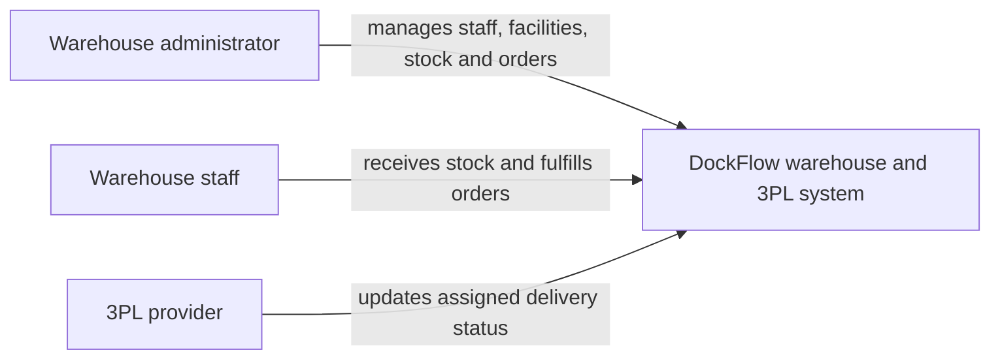
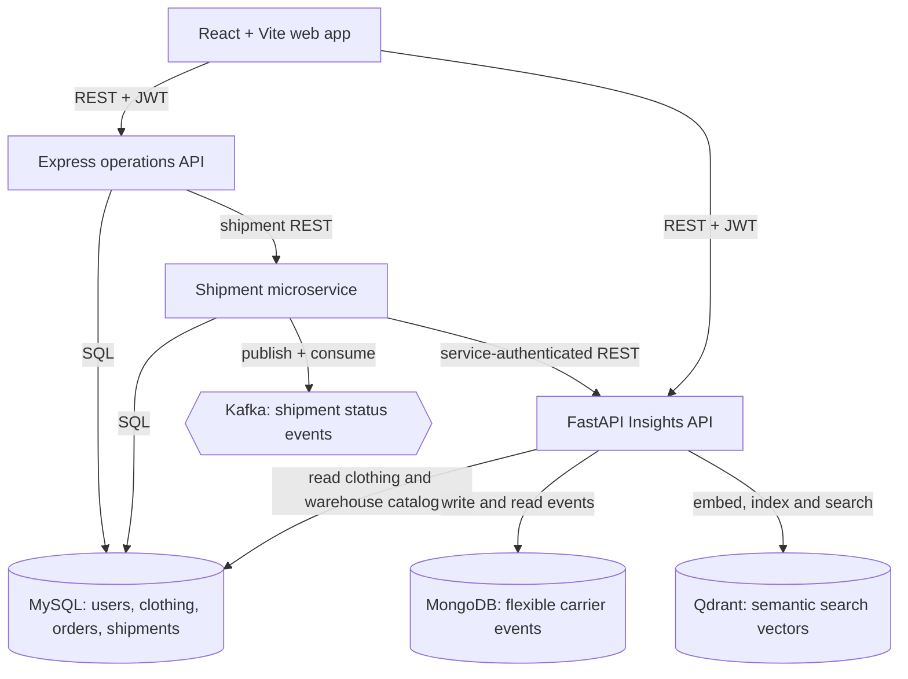

# DockFlow C4 architecture

## System context

## Container view

## Responsibilities

- **Express operations API:** login, roles, clothing inventory, customers, orders, and warehouse data.
- **Shipment service:** shipment reads and status changes; publishes Kafka events and writes an SQL audit event.
- **FastAPI Insights:** validates search, checks JWTs, reads the SQL catalog, stores carrier event documents in MongoDB, and searches Qdrant vectors.
- **MySQL:** authoritative relational records for users, clothing stock, warehouses, orders, and shipment state.
- **Kafka:** local asynchronous transport for shipment status changes.
- **React + Vite:** browser interface and API proxy for local development.
